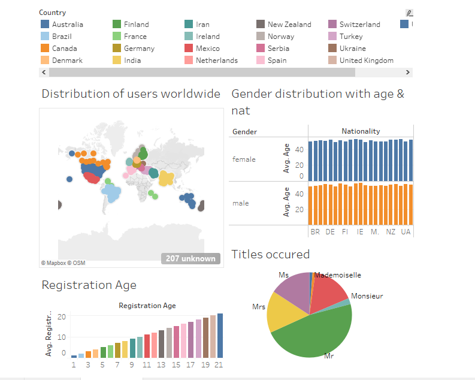
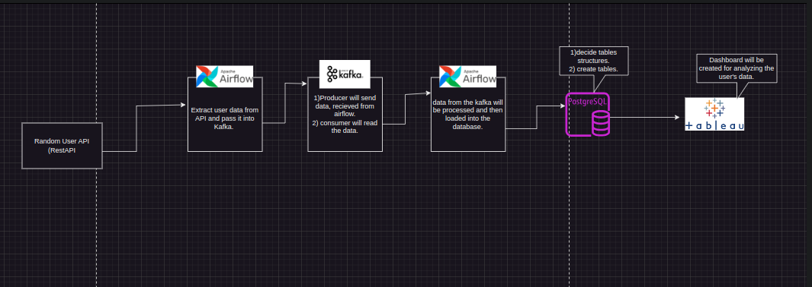
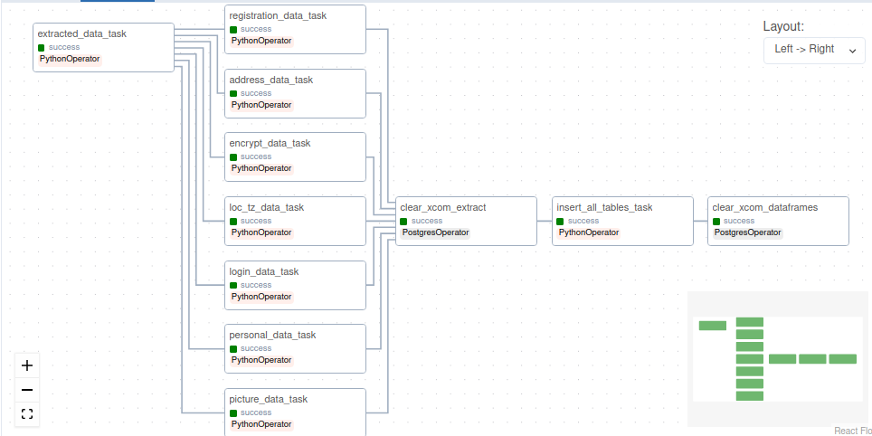
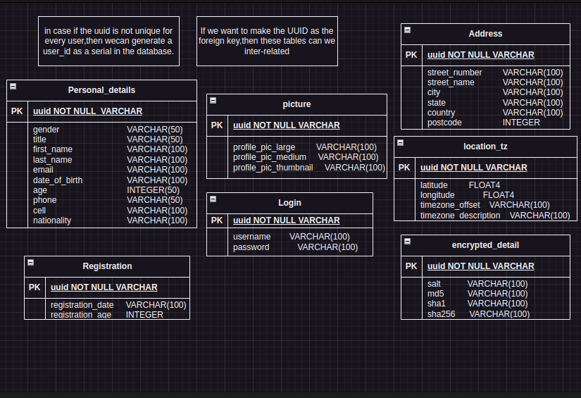

# Real-time User Data Ingestion & Visualizing Dashboard 

```sh
BY: Varun Sharma
```
A dynamic User-identificaion dashboard showcasing comprehensive information on various random people from all over the world.
- Automated the entire data flow using an ETL framework, minimizing human intervention and enhancing efficiency.
- Integrated Tableau with the Postgres, creating a visually compelling and user-friendly dashboard to provide stakeholders with actionable insights.
- Developed the architectural framework using Airflow, ensuring scalability, reliability, and cost-effectiveness.

## Dashboard


## Features

- User Profile Overview:
Display basic user information such as username, email, and profile picture.
- Authentication Status:
- Knowing people around the world: learn about the different people living in the world and their information.
- Customization: Tailor the dashboard to your preferences. Choose your desired info, display the only neccesary information about yourself.
- Informative Visuals: This dashboard features visually appealing charts, graphs, and maps to enhance your understanding of different people around the world.

## Architecture


## DAG Components


## Data Model


## Tech

Weather Dashboard uses number of technologies(either open source):

- [API] - To fetch the data(randomuser-API)
- [Python] - programs to fetch, engineer and push data!
- [kafka] - to fetch the data in real-time
- [Postgres] - Database to store the fetched data.
- [PostgreSql] - Used to create the database.
- [Airflow] - Used to implement the DAGs
- [VScode] - To write programs
- [Tableau] - For making DashBoard
